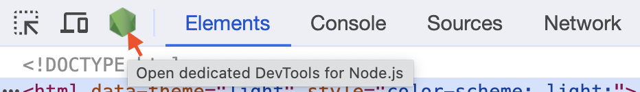
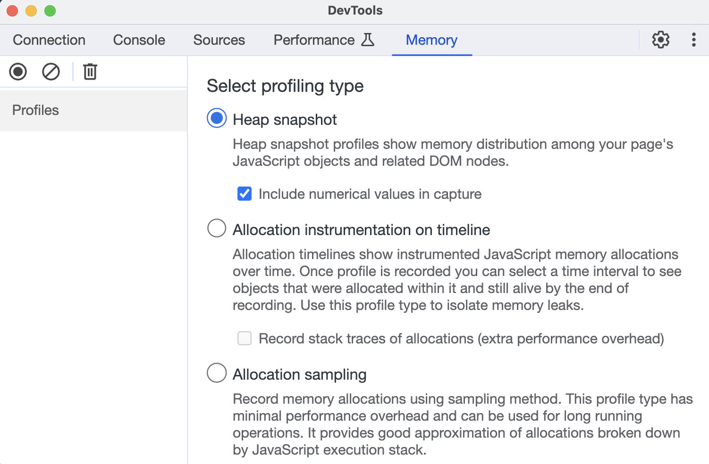
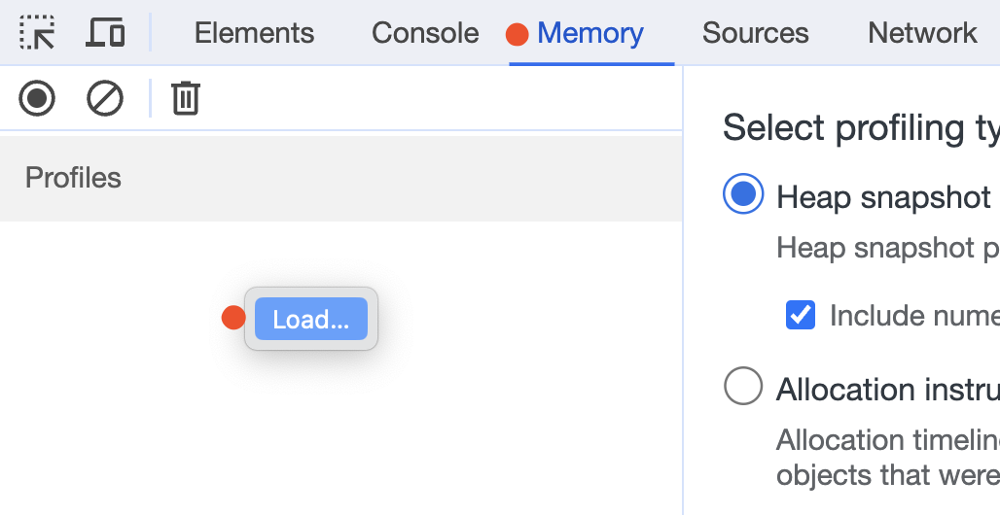
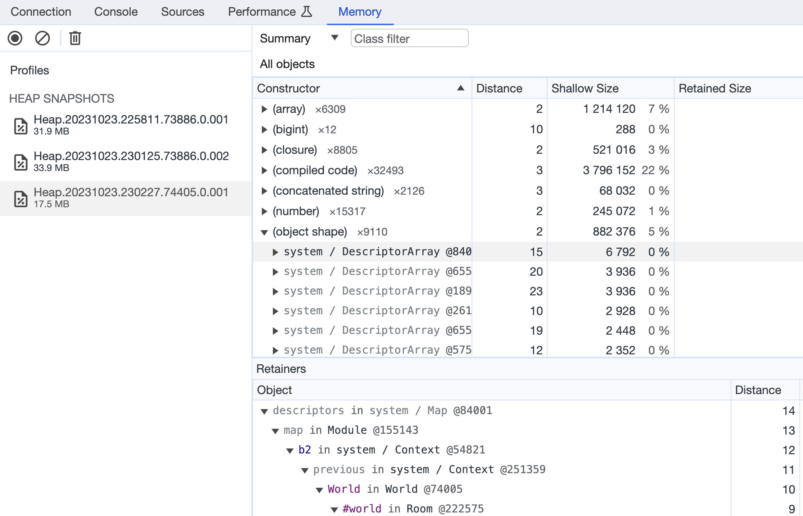
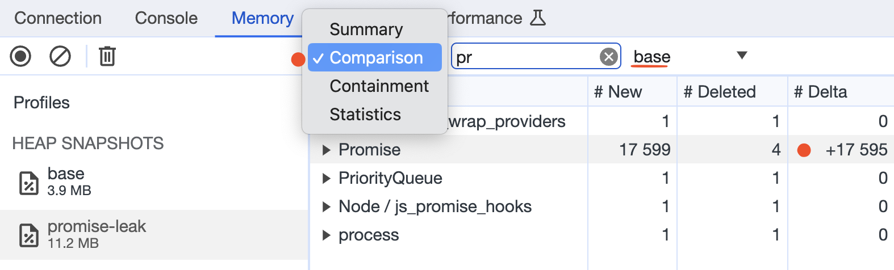

## Why
Memory profiling lets you see the memory usage by application, it can be useful for detecting and [preventing memory leaks](/posts/preventing-memory-leaks-in-js/) in an app, or for optimizations.

## How to
To analyze memory usage you need to generate a memory snapshot from your application, and process or visualize it.

To generate the memory snapshot we can use the built-in tools of NodeJS and load it into Chrome Dev Tools to visualize usage memory by app, lets see how we can do it.
Also, I will show how to compare snapshots and detect memory leaks.

## How to make a memory snapshot
Before considering the different ways to take a memory snapshot, note the following:
- generating a snapshot requires memory [about twice the size](https://nodejs.org/api/v8.html#v8writeheapsnapshotfilenameoptions) of the heap at the time the snapshot is created)
- the consuming memory can be the reason for an Out-Of-Memory (OOM) error in the app, so, restrict access to this part of the code, and check the available memory before generating a snapshot
- generating a snapshot is a synchronous operation, so it blocks the event loop and affects on work of the application, it's especially important if you generate the snapshot on the production environment

Different ways of generating snapshots, but the result is only one - a memory snapshot file, use the way that is most suitable in your case.

### Chrome Inspector
This method includes running an application with a special flag and using Chrome Inspector to generate snapshots.

Run the NodeJS application with the flag `--inspect`
```shell
node --inspect app.js
Debugger listening on ws://127.0.0.1:9229/96fc1cb8-08cf-4477-8291-ca7ba1b49154
```

Run the Chrome browser, open Inspector, and select the NodeJS icon on the top menu.



Then choose the type of memory profiling



And press the `Take snapshot` button.\
As a result, you will get a snapshot file on the left menu, which you can visualize by clicking on it.

This method is suitable if the application is running locally because the browser will use the local application.
Also, the browser tries to find your application's debugger on port 9229, if you need to listen to another port of debugger add your ports at `chrome://inspect`.


### Process signal
In this case, the NodeJS process generates a file of memory snapshot in the running directory when receiving a specified system signal.
Pay attention that the `SIGUSR1` signal is [not available on Windows](https://nodejs.org/en/docs/inspector).

Run the NodeJS process with the flag `--heapsnapshot-signal=SIGUSR2`
```shell
node --heapsnapshot-signal=SIGUSR2 app.js
```

Then send the SIGUSR2 signal to the NodeJS process, where 711 is a PID of the process:
```bash
kill -USR2 711
```

To obtain the PID of the process you can use the command `ps aux | grep node`
Example:

```shell
ps aux | grep node

USER    PID    %CPU %MEM      VSZ    RSS   TT  STAT STARTED      TIME COMMAND
ararat  71135  2.1  0.4 409266720  59600 s004  S+    7:37PM   0:11.84 node --heapsnapshot-signal=SIGUSR2 app.js
```

As a result, we got the snapshot file in the app directory, the file name will be similar to the next: `Heap.20231023.204604.71135.0.007.heapsnapshot`, the pattern of file name described on [documentation](https://nodejs.org/api/v8.html#v8writeheapsnapshotfilenameoptions).\
In our example we used the `SIGUSR1` signal, also we can use the `SIGUSR2`, these signals can be used for user-defined logic, like in our case. More about [POSIX signals](https://en.wikipedia.org/wiki/Signal_&#40;IPC&#41;#POSIX_signals&#41).

### writeHeapSnapshot function
We can make a snapshot in the code by calling the [writeHeapSnapshot](https://nodejs.org/api/v8.html#v8writeheapsnapshotfilenameoptions) function from the v8 module.

```javascript
const v8 = require('node:v8');
v8.writeHeapSnapshot();
```
This code will create a snapshot file in the application directory. With this approach, you can pass arguments in the function for specifying output filename or additional options for the memory heap, more in [documentation](https://nodejs.org/api/v8.html#v8writeheapsnapshotfilenameoptions). Also, you can use your own logic to control when and where to generate a snapshot.

## How to visualize a memory snapshot
To visualize a memory snapshot open Chrome Dev Tools, select the Memory tab, and load the received snapshot that was obtained in one of the steps discussed above.



Example of loaded snapshot:



### How to detect memory leaks
The easiest way to detect memory leaks is by comparing snapshots before and after the completion work of an application, or specific section of code. If the code has been completed but the memory has increased, this may be a sign of a memory leak.

For comparing snapshots, load them to the Dev Tool and choose the comparison object.



This is the test example where I illustrated the Promise leaking, you can use value delta to detect high differences in value between two snapshots.

